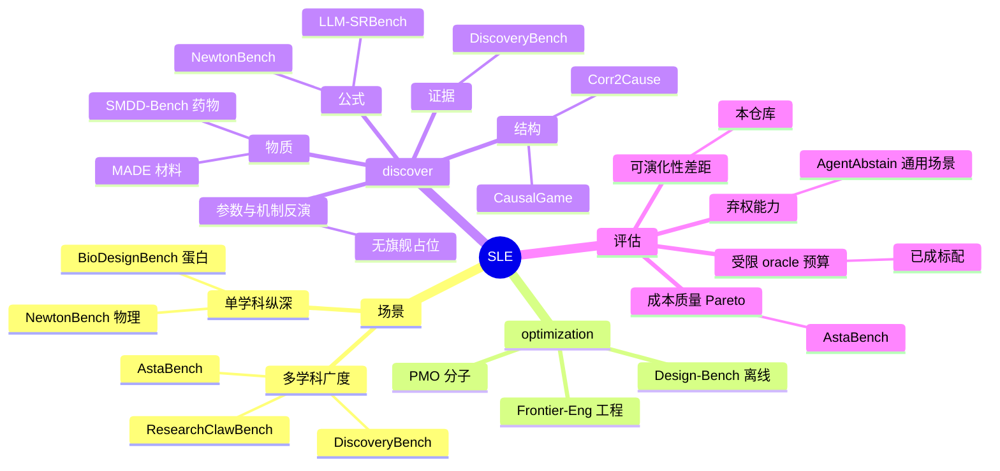

# Scientist's Last Exam

## 背景

Scientist's Last Exam (SLE) 是一个研究原型,面向**跨领域、可执行、预算受限的科学生成式优化**。
它要回答的不是"模型能不能考一次高分",而是**"给模型反馈和更多预算,它在科学上会不会变得更好"**。

同期基准沿任务形式分化,各自占住了一块:



**空位在两处。** 一是"参数与机制反演"—— 从受预算的观测里反演一个机制,或判断根本没有机制可反演;
SLE 19 个发现类任务中有 12 个落在这里。二是**评估形式**:受限 oracle 预算已经是标配
(MADE 50 次查询、CausalGame 10 次部署、PMO-1K 1000 次调用),但**没有一个基准用同一个搜索者的
开环臂做对照** —— 因此"分数变高"与"迭代真的有用"仍然分不开。这两件事就是本仓库要做的。

本仓库受 [Frontier-Engineering](https://github.com/EinsiaLab/Frontier-Engineering) 启发,
与 [arXiv:2601.21165](https://arxiv.org/abs/2601.21165) 中同名的文本题基准无关。

> 更高的模拟器或验证器分数,只能证明在**已登记的 oracle 内部**做了优化。它本身不能确立自主科学发现、
> 机制恢复、物理验证或真实世界效用。

## 两类任务

当前 43 个任务包,横跨 7 个学科,分成两类:

**optimization(24 个)** —— 在一个受约束的设计空间里把目标做得更好:换热器几何、超材料层叠、
桁架截面、解码器策略。分数由**它做出来的东西有多好**决定。

**discovery(19 个)** —— 从受预算约束的观测里恢复一个机制,或者判断根本没有机制可恢复。
每题包含三种世界:机制在候选可表达的模型族内(**该找出来**)、机制在族外、以及**根本没有机制**
(后两种**该拒答**)。候选看不到自己面对的是哪一类。

发现类分开报告三个轴,**永不平均**:

| 轴 | 问的是 |
|---|---|
| 机制恢复 | 找对了多少 |
| 假发现率 | 在不该宣称的世界上宣称了机制 |
| 校准拒答 | 在该拒的世界上拒了 |

不能合成一个数,因为**全面弃权的候选在后两个轴上都是满分** —— 只有机制恢复是 0。
另有一列"是否尝试过发现":三元组说的是**做得多好**,它说的是**到底有没有试**。

## 任务形式

一个任务是一个可运行程序加一个隐藏的确定性 oracle。搜索者编辑程序,oracle 打分,分数回到下一轮提案。

```text
<Task>/
├── Task.md                       # 智能体可见的任务描述
├── TASK_CARD.yaml                # 科学证据与评审记录
├── solution.py                   # 弱但合法的基线
├── frontier_eval/                # metadata.yaml、entrypoint.txt、constraints.txt 等
├── verification/
│   └── evaluator.py              # 隐藏的冻结 oracle
└── references/
    └── known_best.md             # 不设上限的任务必需
```

分数经过归一化:**0 是出厂基线,1 是参考见证解,且不设上限** —— 赢过参考解必须能与追平它区分开。
发现类的归一化让**全面弃权恰好得零**。

evaluator 至少返回有限数值的 `combined_score` 与 `valid`。
`python -m sle list --all` 是权威的实时清单。

## 评测形式

核心量是**可演化性差距 Δ**:

```
normal            搜索者看得到分数,能据此迭代
selection_blind   种子配对、预算相同,但每个提案只看得到冻结的基线
Δ = normal − selection_blind
```

`selection_blind` 是严格的开环对照,它把"best-of-N 抽样"与"真的在迭代"分开。
准入判据是**两段式**的:开环对照必须先饱和(否则分数高只说明抽样够多),然后 Δ 随预算扩大才算数。

**可见性合约**:搜索者只收到 `combined_score`、有效性、可行率。稳健性、机制恢复、逐实例指标是
evaluator-only,不能被直接优化。

**执行环境**:候选代码通过带类型的 JSON-RPC 边界、在无网络的 Bubblewrap 内单独运行,
oracle 运行在受信父进程。只读挂载、私有临时文件系统、资源限制、seccomp 阻断进程创建,
以及标签盲的失败分类 —— 把候选可控的异常文本从搜索反馈中剔除。

```bash
python -m sle list                                    # 只列 certified,--all 含 candidate
python -m sle eval --task Chemistry/LennardJonesCluster

bash scripts/setup_oracle_env.sh --check              # 社区 oracle 工具包
cp sle/conf/llm/openai_compatible.example.yaml sle/conf/llm/local.yaml
export OPENAI_API_KEY=your_key_here && python -m sle smoke

python -m sle run \
  --task Chemistry/LennardJonesCluster \
  --algorithm greedy_rewrite --budget 10 --seed 0 \
  --workdir runs/lj/seed-0
```

可用算法:`greedy_rewrite`(内置)、`openevolve`、`abmcts`、`shinkaevolve`。指名的后端若不可用会
**显式失败**,绝不静默回退。

实验报告按哈希绑定 Git 修订、命令、源码树状态与信任判定 ——
**无法绑定到产出它的运行时的证据会被拒绝,而不是被悄悄复用**。

当前的测量结果、准入判据的完整判决与开放项,见
[详细发现与审计](.research/findings_and_audits_2026-08.md)。

## 如何贡献

新任务需要满足的契约与认证要求见 [`CONTRIBUTING.md`](CONTRIBUTING.md)。要点:

- **oracle 必须冻结且确定** —— 同一个候选每次得同样的分。任何进程级随机源(包括社区库内部的)
  都要定种。
- **候选打不挂 evaluator** —— 写坏的提交该得零分,不该让整个 cohort 的证据陪葬。
  `scripts/check_evaluator_survives_bad_candidates.py` 会检查这一点。
- **锚点要可重新推导** —— 由 evaluator 重算,或以可运行的参考实现交付。对着一个本地无法核对的
  字面量归一化,需要在 `references/known_best.md` 里写明来源。
- **提交契约要写进 `Task.md`** —— 候选只能靠抄基线才能知道的键名,会把契约难度混进科学难度。
- **发现类任务要报满三个轴** —— 并且要能区分"弃权"与"尝试了但没做对"。

加一个包只是让它可被发现,**不等于认证**。认证描述的是证据质量,不是任务难度。

```bash
python -m unittest discover -s tests -q
python scripts/audit_tasks.py --output /tmp/certification.json
python scripts/audit_benchmark_standards.py --output /tmp/standards.json
```
