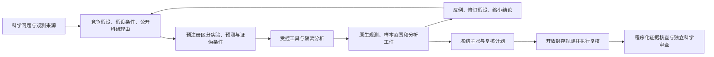

# Discovery：主张、过程证据与结果验证

发现的工作定义：在明确的新颖性范围内，通过可追溯的调查、推导或实验，对此前未确定的问题形成可检验的知识主张，并获得与主张类型匹配的验证支持。

本定义是 SLE 的评测约定。重发现可以测科学能力；它不自动等于领域新发现。优化也可能产生新的数学构造、方法或性能界，`optimization` / `discovery` 是任务组织方式，不是科学价值的互斥分类。

## 主流程：没有 GT 的科学发现

**问题 → 竞争假设 → 实验或推导 → 证据 → 检验（必要时修订）→ 有适用范围的结论。**
其中结论可以涉及规律、结构、机制或物质，也可以是对参数的有边界估计。
这些是主张类型，不是发现必须依次经过的阶段；检验后的必要修订可以返回假设或实验设计，检验支持原假设时不要求强行修订。

Discovery 的评估对象是**一项科学主张如何从证据中形成、经受检验并限定适用范围**。
不要求隐藏正确答案,也不要求恢复任务作者预先选好的机制。负面结果、发现当前证据无法区分
解释、收缩结论或保留判断,都可以是有效产出。是否形成领域新知识仍需独立审查。

`sle episode` 现在默认 `--evaluation-mode evidence`。该路径不会调用任务的
`validate_claim`、`confirm` 或 `evaluate` 真值接口;它只向测量工具请求观测,将冻结的假设和
预测与原生证据进行检查。旧的隐藏真值分数必须显式选择 `--evaluation-mode oracle`,仅用于
模拟构建诊断。旧结果中的满分不能证明或否定这里的发现质量。

### 多轮科学工作流



允许多轮 `hypothesize`、`plan_test`、`experiment`、`analyze` 和 `revise_hypothesis`。
假设和计划 ID 不可覆盖;修订创建新 ID 并指向旧假设,保留失败预测和修订理由。
要求简短、可检查的科研理由、假设条件和推导工件,不按推理文本长度给奖励。

每个检验在观测前绑定工具、精确参数、测量位置与聚合方式,并提出至少两个竞争假设的有限
预测区间及可选证伪区间。测量提取只支持有限 JSON 路径和 `scalar/mean/sum/min/max`,
不会在受信评测进程执行候选代码。重叠、嵌套且无法排除替代解释的宽泛预测只有相容性记录,
不会自动获得区分性支持。

最终 dossier 包含 `claims`、`replication_tests`、`limitations`。每项主张引用假设 ID、
原生支持/反证 ID、计划 ID,声明 `supported/rejected/inconclusive` 及限制。
冻结后最多执行八项事前登记的复核检验,所有实验共享同一预算;不再接受改写主张。
复核结果自动进入核查,即使它反驳了提交者的结论。没有主张的空发现合法,不会产生虚构成功率。

### 分开评价证据与推理

| 维度 | 当前可执行检查 | 仍需独立科学审查 |
|---|---|---|
| 问题与假设 | 版本链、显式假设、竞争预测、可操作测量 | 科学问题价值、假设是否实质可证伪、替代解释是否合理 |
| 实验过程 | 事前计划绑定、真实工具请求、资源消耗、数据来源范围 | 实验是否能区分关键解释、对照和混杂处理是否充分 |
| 证据使用 | 引用真实观测、重算测量、检查所有相关检验 | 测量与主张的语义是否对应,是否从关联越界到因果 |
| 反证与修订 | 检测反例遗漏、保留失败预测及旧假设 | 修订是否由证据驱动,是否只是移动判定标准 |
| 预测与复核 | 提交后观测是否符合事前区间、区分哪些替代解释 | 区间校准、多重检验、复核样本的独立性 |
| 复现与贡献 | 工具、参数、数据版本和事件链可重放 | 推导和计算可复现性、外部适用性、新颖性及科学贡献 |

运行报告分别输出 `process`、`prospective_checks`、逐主张 `evidence_status` 和
八轴 `semantic_review`。后者包含待评问题及假设/计划/证据引用,默认全部 `unassessed`。
尚未进行独立审查的维度不填分。没有 GT 时不报告“机制恢复正确率”或真实 FDR;
反证披露率和引用核验率都有各自分母,不能改名为发现正确率。N=0 保持 `null`。

上述 dossier 与指标名描述默认 v1。显式的 [posttest-v2](discovery_posttest_v2.md)
另有检验后解释及复合主张检查，历史报告不迁移或重算。
[独立科学审阅约定](discovery_scientific_review.md)提供六阶段与八轴的具体审阅条目及只读准备工具；
导出的空白表单不表示已经完成科学审阅。

`evidence-supported` 仅表示前瞻登记的操作性预测与观测相符,且能区分至少一个声明的替代解释。
它不证明假设为真、机制唯一、研究无混杂或结论有领域新颖性。一个容易打败的替代假设也可能
产生相容结果,因此独立审查必须检查替代解释和区间设定。当前没有 LLM judge 或自动 discovery 总分。

### 防止事后验证和自述证据

证据由工具代理生成 `experiment-0001` 等 ID,候选分析代码输出的 ID 或声称成功的日志不能替代它。
主张核查遍历该假设的所有相关检验,不只看提交者挑选的支持证据。看到数据后才写入的计划,
以及换工具对已经看过的同一列、同一批样本再求均值,都标为事后描述,不能获得前瞻支持。

测量适配器记录数据摘要、分区、测量列和样本 ID。即使计划在前,反复读取相同样本也只是
复用数据,不是增加独立样本数。未知来源范围不推断为新样本;封存分区也不自动等于独立采集。
同一数据包更换 `--seed` 不会制造新的科学世界。跨 episode 的污染、公开数据记忆、来源真实性
和采集独立性需要在正式数据/评测设计中另行控制。

### 隔离执行与真实数据入口

`DiscoveryEvidence/MeasurementAudit` 接受只有数值观测的两文件数据包:
`manifest.json` 描述列、单位、采集来源、总体、独立性单位、复核设计和限制,
并绑定 `measurements.csv` 的 SHA256。CSV 具有样本 ID、事先指定的探索/复核分区和数值列。
没有机制标签、隐藏参数、数据生成器或正确答案函数。

数据包按白名单读取,拒绝符号链接、额外文件、重复 ID、非有限数值和摘要不一致。
加载后固定内存快照,数据来源陈述标为 `operator_asserted_not_verified`。
`read_measurements` 只能读探索数据;`summarize` 提供有费用的均值和组间差异观测。
封存数据只有冻结提交后才能通过工具读取。查询价格和输入校验不依赖封存分组成员,
避免通过费用或报错探测未开放数据。

候选程序及持久 Python 分析均运行于 Linux CandidateProxy/bubblewrap:
网络和进程创建被禁用,文件系统仅挂载白名单 Python/NumPy/SciPy 与候选文件,
不挂载数据包、验证代码、宿主目录或凭证。每个 episode 使用新进程和独立临时文件系统;
同一 episode 内可保留分析变量。工具只接受声明过的 JSON 参数,不开放宿主 shell。
模型调用与探索工具受总时限约束;冻结后的复核另有最多 60 秒时限。
CPU、内存、文件大小、文件描述符、步数、实验量、JSON 和证据体积均有界。
Linux 沙箱不可用时会失败,不会回退为宿主 Python 执行。

```bash
# 工程协议示例:没有科学发现能力含义,不调用模型 API。
python -m sle episode --task MeasurementAudit --baseline protocol \
  --output-dir /var/tmp/sle-discovery-protocol

# 真实观测包由可信评测侧提供;凭证仅存在于模型配置,不进入候选环境。
python -m sle episode --task MeasurementAudit \
  --data-bundle /private/operator/observed-study \
  --llm-config /private/operator/model.yaml --analysis sandbox \
  --max-steps 64 --wall-seconds 600 --experiment-budget 20000 \
  --output-dir /var/tmp/sle-observed-discovery

# 程序接口:solve(context, act),通过 act(JSON action) 进行多轮科学操作。
python -m sle episode --task MeasurementAudit --program scientist.py \
  --data-bundle /private/operator/observed-study \
  --output-dir /var/tmp/sle-observed-program
```

完整动作示例见 `benchmarks/ComputerScience/MeasurementAudit/examples/discovery_actions.json`。
操作方可用 `--experiment-budget` 为较大数据包设定足够的总预算;该条件绑定到报告,
所有模型应使用事先固定的同一预算,并为提交后复核预留实验量。
默认随附数据是公开、手工填写的协议夹具,用于验证管线,不得计作真实研究数据或难题评测。
`protocol/null/fabricated_citation/broad_predictions/posthoc_retest` 是协议正负对照。
模型只能获得观测反馈;评审结果保存在可信侧。完整报告可由原生事件重建核查,但可重算的
哈希仍不提供来源认证。生产任务需要实际科学问题、有来源的观测和独立审查。

### 无 GT 流程的工程验证（2026-09-19）

实现提交 `c77e96aa` 的本地相关回归为 **241 passed、19 skipped、54 subtests passed**。
Linux Python 3.8/bubblewrap 上的扩大回归为 **302 passed、1 failed**；唯一失败来自新测试
误把创建未连接的 socket 当作联网成功。网络命名空间允许创建 socket,但没有外部路由。
提交 `eaf23842` 将断言改为实际连接必须返回网络不可达或权限拒绝,不接受超时;
两个科学 episode 隔离测试文件复验 **7/7 passed**,包括原失败项,没有遗留失败。
复验只改测试断言,未修改运行时、观测适配器或放宽隔离策略。

真实 Linux 测试覆盖候选与分析进程无法读取宿主数据和凭证、封存数据提前请求被拒绝、
网络连接及进程创建受阻、同轮分析状态保留、新 episode 状态清空,以及完成多轮后冻结复核。
独立代码审查还发现并修复了分组统计遗漏分组列来源范围的问题;跨列事后检验回归确保
已经从分组数/样本身份获知的信息不能再次获得前瞻支持。

冻结实现下五类协议对照结果如下,全程没有模型 API 调用:

| 对照 | 结果 | 科学解释 |
|---|---|---|
| 预注册后探索与封存复核 | `evidence-supported` | 仅操作性预测获得支持 |
| 空发现 | 完成,所有空分母为 `null` | 没有虚构成功率 |
| 伪造证据引用 | `invalid_candidate` | 不生成科学评分 |
| 无区分能力的宽泛预测 | `inconclusive` | 不能因覆盖所有结果而获支持 |
| 先看数据再登记并重测 | `unassessed` | 事后描述不能算前瞻验证 |

这些结果只验证工程协议。八项科学语义审查仍全部为 `unassessed`,没有测得任务难度、
科学贡献或模型发现能力。实际观测任务的学科审阅和模型标定尚待开展。

## 旧 oracle 任务的证据记录范围

- 注册表中每个 discovery 任务都有可生成的 profile；尚未审查者标记 `not_assessed`，不按名称或 kind 推断层级。
- 四个试点已静态检查，并在正式可信评测入口记录输入、callback 请求/返回/错误和最终提交：ForceFieldCalibration、InterventionalSCM、ActiveLawDiscovery、ProspectiveMetaAnalysis。
- 记录与逐世界 oracle 结果绑定，过程、结果、资源分组保存；未改变候选函数签名或现有分数公式。
- 可校验事件顺序、摘要、候选身份、callback 对应关系和记录完整性。摘要只提供内容绑定，不提供来源认证；正式证据仍需通过外层运行验证。
- 没有新增 LLM judge、过程综合分、自动领域新颖性判断或自动认证。实验是否有信息、推理是否有效、修复是否有用，仍需任务特定检查与对照实验。

四题的 profile 是 `source_inspected`，不是独立科学审核通过。所有认证状态继续来自 `sle/certification.yaml`。

## 能力档案

主张类型、开放度、验证方式、新颖性范围分别记录：

| 字段 | 含义 |
|---|---|
| `claim_types` | 参数、结构、规律、机制、预测、证据综合等主张 |
| `openness` | L1 已知模型内估计；L2 枚举解释辨别；L3 组合生成结构/规律；L4 实质扩展候选空间 |
| `given` / `unknown` | 题面已经给出的知识，以及真正需要求解的科学对象 |
| `verification` | 模拟真值、封存预测、预提交后的新确认、独立来源或证明路径 |
| `world_type` / `novelty_scope` | 模拟/真实来源及“新”是相对什么而言 |
| `source_sha256` | 本次 profile 引用的题面、任务卡、oracle 版本 |

L1–L4 描述开放度，不保证难度单调，也不代表证据强度。数学证明不需要先通过实验等级；统计关联、因果解释和领域新颖性分别验证。

```bash
python scripts/report_discovery_evidence.py --output /tmp/discovery_profiles.json
```

报告枚举全部 discovery 任务，并分别显示 `source_inspected` 和 `not_assessed`。科学问题与产物从 TASK_CARD 读取，属于任务声明，不能当作已确认的科学成果。

## 可信边界记录

`sle.secure_eval.trusted_evaluate` 为四个试点自动包装候选 RPC 接口。数据由 oracle 所在进程记录，候选的自述日志不会替换这些记录。

每个候选实例形成以下事件：

```text
input
callback_request -> callback_result | callback_error
... 可重复 ...
submission | candidate_error
```

`input` 保存候选实际收到的公开参数，callback 位置只保留工具名。请求参数在执行前快照，观测在返回候选前快照，最终提交在交给 oracle 验证前快照。NumPy 数组使用既有 RPC codec 保存 dtype、shape 和原始字节；可用 `sle.rpc_codec.decode` 读取，不执行记录中的代码。

ProspectiveMetaAnalysis 的 `confirm` 请求保留确认前提交，后续 observation 与最终 submission 分开保存。真正的提交合法性和不可变性仍由该题的 oracle 检查。请求被记录不代表确认成功，确认成功也不代表主张被证实。

ForceFieldCalibration 的请求包含其已有假说权重与保留集合，提交包含其已有 evidence IDs。SCM / ActiveLaw 当前只暴露实验决策和最终模型，未暴露中间假说，因此不得宣称已经检查了其全部假说更新。

观测与提交处在同一个实例不证明模型用了该观测。报告明确区分 `available_evidence_seq` 和未评估的证据使用质量。静态初始数据也属于可用证据，不按工具调用数量给奖励。

外层搜索轨迹记录 LLM 如何生成、选择候选程序；本记录描述生成程序在内层科学环境的行为。`candidate_sha256` 连接两者，不能把内层全部动作归因成 LLM 逐步推理。

## 结果与可见性

完整 metrics 中新增 `discovery_evidence`，包含身份、事件链、逐世界结果和完整性标记。它是 evaluator-only，既有 `search_visible_metrics` 白名单不会向搜索者暴露它。使用 task-local wrapper 时，仅在提供私有 `--full-metrics-dir` 后保存完整 metrics；公共 metrics 不含此字段。

逐世界结果保留原 split。SCM 是 `unsplit`，其封存干预是同一世界内的结果检验，不能改名为 heldout cohort。ActiveLaw 的 `validation` 和受信上下文的 `confirmation` 也保持原名。ProspectiveMetaAnalysis 的新研究是模拟确认，不是临床试验。

```bash
# 在可信 Linux 评测主机运行；输出文件必须放在搜索者不可读的位置。
python -m sle eval --task CausalDiscovery/InterventionalSCM --allow-uncertified \
  --candidate benchmarks/ComputerScience/InterventionalSCM/solution.py \
  > /private/operator/scm_full_metrics.json

python scripts/report_discovery_evidence.py \
  --metrics /private/operator/scm_full_metrics.json \
  --candidate benchmarks/ComputerScience/InterventionalSCM/solution.py \
  --output /private/operator/scm_discovery_report.json
```

`--candidate` 检查源码绑定，不提供身份认证。这个独立文件报告只输出 `structurally_consistent`；需要结合已有运行 manifest、evaluation ledger 与 `sle.run_verification` 判断是否是正式可信证据。没有记录的历史成绩标记 `not_recorded`，不倒推过程分。

原始结果指标分别放入 `process`、`result`、`resources`。过程组中若已有 lineage / acquisition 指标，仍是原 oracle 的诊断，不把它解释成经过跨学科校准的过程总分。无指标不补零。

结果正确性、预测质量、机制恢复、错误主张、拒答与覆盖仍须分开解释。经验错误比例不自动意味着理论 FDR 控制；分母和 split 遵循 TASK_CARD 的现有 metric contract，未完成的计数迁移仍是独立待办。

## 完整性、失败与限制

- 每个事件序号连续，引用前一个事件摘要；观测必须有此前匹配的请求，最终提交必须在 callback 完成后。
- 事件及整体摘要可发现意外修改，但可重算摘要的攻击者仍能伪造独立 JSON。不要把结构校验叫作来源认证。
- 记录有每次评估 32 MiB payload 与每实例 512 个事件的上限。超限或无法编码标为 `incomplete`，继续原科学评价；不能宣称完整过程证据。
- 候选 RPC 失败保留已记录的部分轨迹，公开失败分类保持不变。评测进程本身崩溃或启动失败可能无记录；这属于证据缺失，不能直接归因为模型造假。
- 当前结果绑定依赖 oracle 逐世界调用顺序与显式 split/world_index。接口或顺序变化需要同时更新适配器，并运行四题关联测试。
- 本轮给两个 oracle 补充逐世界身份字段，同时改变了共享 runtime；相应 package/runtime hashes 会变化，不自动签发历史版本等价关系。

## 分数本身是否守得住

上面记录的是过程,不是打分的有效性。一道题的分数能不能在不做科学的情况下拿到,以及它能不能
分出比参考解更强的候选,是两个独立的问题,`scripts/audit_discovery_discrimination.py` 分别测量
它们,结果和建议的判据见 [discovery_discrimination.md](discovery_discrimination.md)。

## 后续准入与对照

下一步依次完成：四题主张语义与可辨识性审核；任务特定过程检查；独立 oracle 复核；主动/固定实验与有/无诊断重跑对照；再扩展到其余题。不能凭日志齐全就认证一个发现。

新增任务应在 TASK_CARD 明确未知量、主张、适用范围、竞争解释和验证路径；采用新主张接口或改变确认规则时发布科学新版本。没有修复机会的 Repair 是 N/A；有机会但没有完成应单独记录，不能当 N/A。

DiscoveryBench 的结构化主张提供了结果表达参考；TRACES 将过程与结果评审分开；SDABench 按不同科学主张的能力组织任务。这些工作启发本设计，并不意味着 SLE 的等级与它们等价。[DiscoveryBench](https://arxiv.org/abs/2407.01725)、[TRACES](https://www.apodex.com/blog/apodex-discovery)、[SDABench](https://arxiv.org/abs/2607.11079)。
